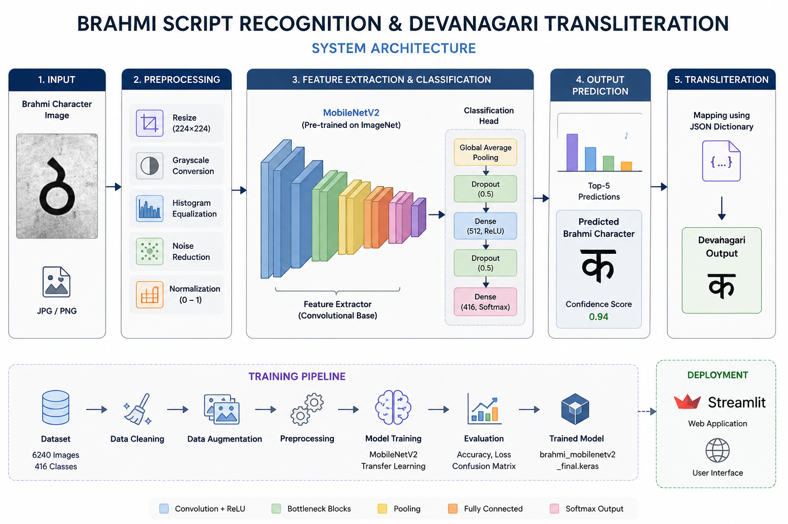
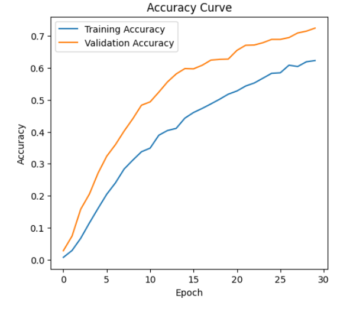
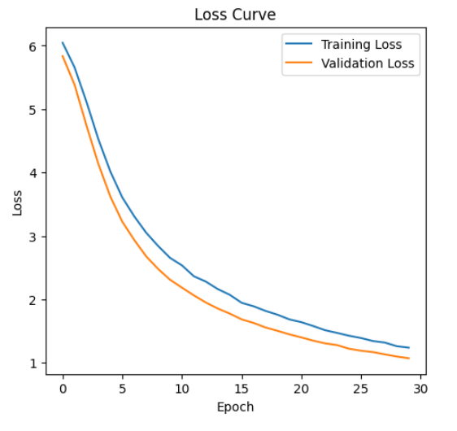
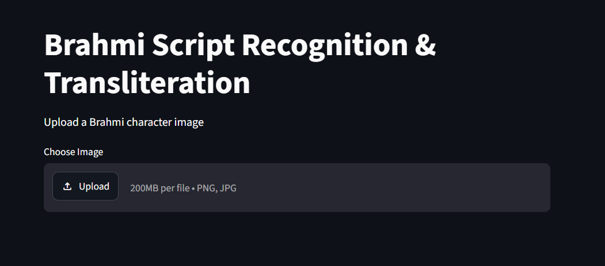
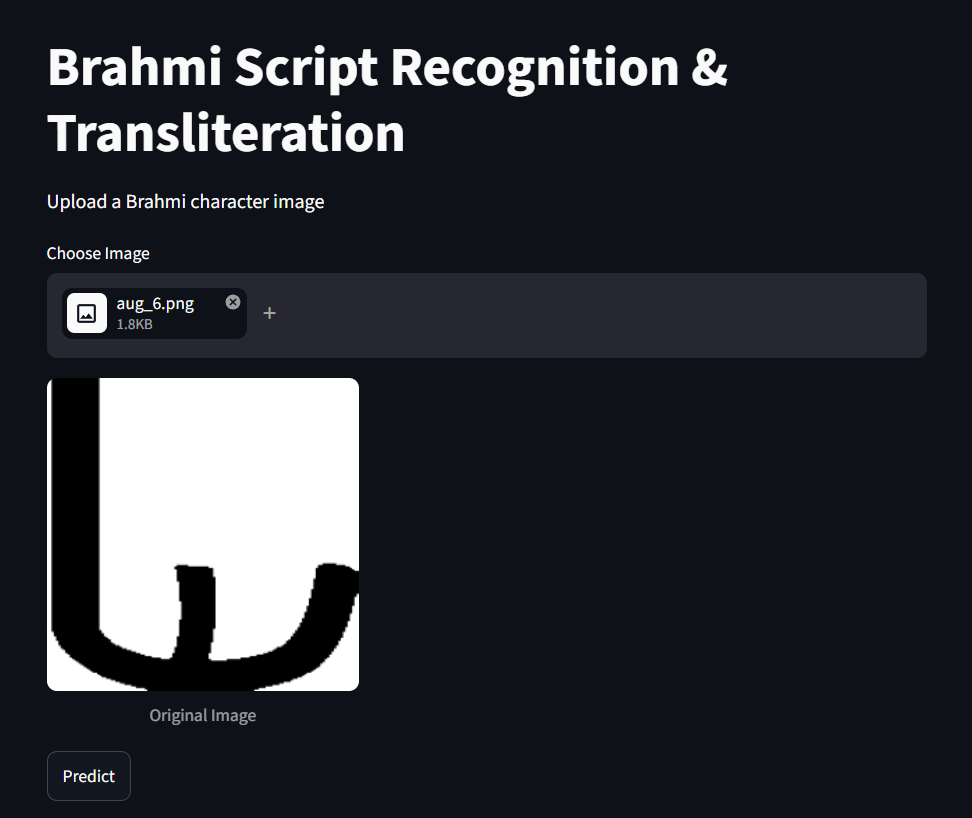
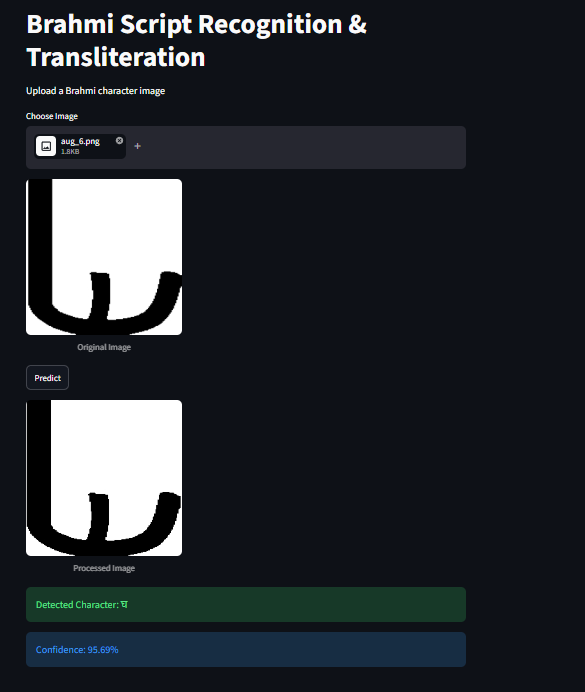

# 🏛️ Brahmi Script Recognition & Devanagari Transliteration

> **Deep Learning-based Computer Vision System for Ancient Brahmi Script Recognition and Devanagari Transliteration using MobileNetV2 Transfer Learning.**



---

## 📖 Overview

Brahmi is one of the oldest writing systems of the Indian subcontinent and is considered the ancestor of many modern Indian scripts. Recognizing and transliterating Brahmi inscriptions manually requires expert knowledge and is often time-consuming.

This project presents an end-to-end Deep Learning pipeline capable of recognizing Brahmi script characters from images and transliterating them into their corresponding Devanagari characters. The system is powered by **MobileNetV2 Transfer Learning**, a custom-built dataset, image preprocessing techniques, and a **Streamlit web application** for real-time inference.

---

## ✨ Features

- 📜 Recognizes ancient Brahmi characters
- 🔤 Converts Brahmi characters into Devanagari
- 🧠 MobileNetV2 Transfer Learning
- 🖼 Automatic image preprocessing
- 📈 Confidence score prediction
- ⚖ Balanced dataset generation
- 🚀 Streamlit-based web application
- 💾 JSON-based character mapping
- 📊 Training visualization and evaluation

---

# 🏗️ System Architecture


---

# 📂 Dataset

The dataset was prepared using a custom preprocessing and augmentation pipeline.

| Property | Value |
|----------|-------|
| Total Classes | **416** |
| Total Images | **6240** |
| Images per Class | **15** |
| Image Size | **224 × 224** |

### Dataset Preparation Pipeline

```
Original Dataset
        │
        ▼
Dataset Cleaning
        │
        ▼
Dataset Balancing
        │
        ▼
Image Augmentation
        │
        ▼
Image Preprocessing
        │
        ▼
Processed Dataset
```

---

# 🧠 Model Architecture

The recognition model uses **Transfer Learning** with **MobileNetV2**.

```
Input Image
      │
      ▼
Resize (224×224)
      │
      ▼
Normalization
      │
      ▼
MobileNetV2 Feature Extractor
      │
      ▼
Global Average Pooling
      │
      ▼
Dense Layer (ReLU)
      │
      ▼
Dropout
      │
      ▼
Softmax (416 Classes)
      │
      ▼
Predicted Character
      │
      ▼
JSON Character Mapping
      │
      ▼
Devanagari Output
```

---

# 📊 Training Results

| Metric | Value |
|--------|-------|
| Model | MobileNetV2 |
| Optimizer | Adam |
| Epochs | 30 |
| Validation Accuracy | **72.44%** |
| Validation Loss | **1.0711** |

### Accuracy Curve



### Loss Curve



---

# 🖥️ Application Demo

### Home Page



---

### Upload Image



---

### Prediction Result



---

# 📁 Project Structure

```
Brahmi-Transliteration
│
├── assets/
├── configs/
├── fonts/
├── mapping/
├── model/
├── scripts/
│
├── app.py
├── README.md
├── requirements.txt
├── LICENSE
└── pyproject.toml
```

---

# ⚙️ Installation

Clone the repository

```bash
git clone https://github.com/krishnikbarman/Brahmi-Transliteration.git
cd Brahmi-Transliteration
```

Install dependencies

```bash
pip install -r requirements.txt
```

Run the application

```bash
streamlit run app.py
```

---

# 🚀 Usage

1. Launch the Streamlit application.
2. Upload a Brahmi character image.
3. The image is automatically preprocessed.
4. The trained MobileNetV2 model predicts the character.
5. The corresponding Devanagari character and confidence score are displayed.

---

# 🛠️ Technologies Used

- Python
- TensorFlow
- Keras
- MobileNetV2
- OpenCV
- NumPy
- Pillow
- Matplotlib
- Streamlit
- JSON

---

# 📌 Applications

- Ancient Script Recognition
- Historical Document Digitization
- Cultural Heritage Preservation
- Educational Learning Tools
- OCR Research
- Computer Vision Research

---

# 🔮 Future Improvements

- Support for handwritten Brahmi characters
- Sentence-level transliteration
- Vision Transformer (ViT) based models
- Domain adaptation for user-drawn inputs
- Mobile application deployment
- Ancient inscription recognition from photographs

---

# 👨‍💻 Author

**Krishnik Barman**

B.Tech in Computer Science & Engineering

**Areas of Interest**

- Artificial Intelligence
- Deep Learning
- Computer Vision
- OCR Systems
- Ancient Script Digitization

---

# 📄 License

This project is released under the MIT License.

---

# ⭐ Support

If you found this project useful, consider giving it a ⭐ on GitHub.